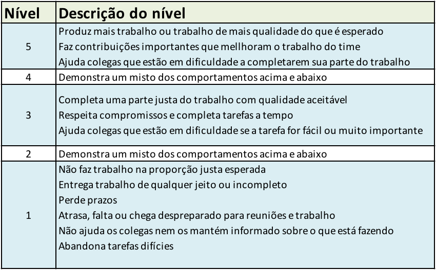
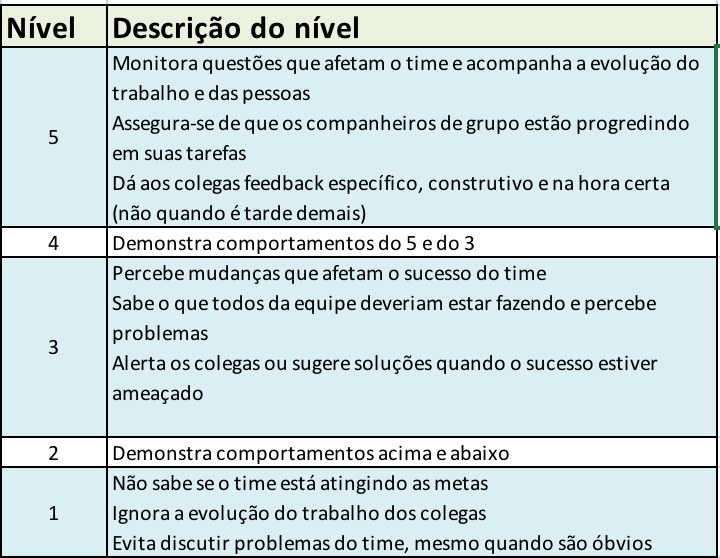
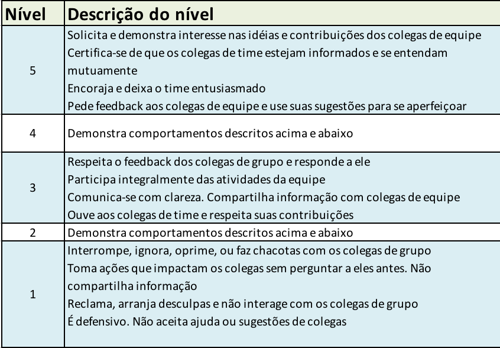

# Projeto 3 - Ciência dos Dados

# Ciência dos Dados 2019

Este documento apresenta as premissas do projeto final de Ciência dos Dados.

**Baixe o PDF para os links funcionarem**

### Objetivos

O principal objetivo do Projeto 3 é conduzir uma análise de dados com grau elevado de autonomia e liberdade de escolha de tema e de técnica.

As técnicas a ser utilizadas serão: regressão linear, regression tree, random forest regression, *multinomial naive bayes*, regressão logística, *decision tree*, *random forest* e clusterização (k-means).

Para que este fim possa ser alcançado, os estudantes deverão se aprofundar na técnica escolhida enquanto realizam o projeto.

É importante que o trabalho produza uma conclusão analítica e vá além da análise exploratória. Esta conclusão analítica deve ter a forma de classificação (supervisionada ou não supervisionada) ou regressão.

### Grupos

O projeto pode ser realizado em grupos de no máximo 4 alunos.

### Datas

Data | Entregável 
---|------------------------------------------------|
31/10 | Kickoff do projeto
5/11 | Definição de grupo e 2 propostas de tema (técnica e dataset)  por grupo. Deixe claro em cada proposta qual o tipo de variável predita 
12/11 | Datasets lidos e análise exploratória concluída (entrega via Blackboard)
14/11 | Algortimo gera alguma resposta (check em aula)
19/11 | Entrega dos resultados (entrega via blackboard)
21/11 | Entrega do relatório com  explicação detalhada da análise, conclusões e referências para fundamentação teórica

### Sugestões de temas a utilizar

Nota: [há muito mais datasets listados neste link](http://goo.gl/Wva3vA), os exemplos abaixo servem só para dar uma ideia .

#### 1. Regressão

As técnicas que se prestam a este tipo de análise: regressão linear, *regression tree*, *random forest regression*

Prever o valor de uma coluna de um dataset em função das outras. Pode ser uma regressão linear (se  a variável de saída for quantitativa) ou regressão logística (se a variável de saída for qualitativa)

Exemplos de datasets:

[Predição de preços de casas em King County, Seattle](https://www.kaggle.com/harlfoxem/housesalesprediction)

[Predição de por quanto uma casa vai ser vendida](https://www.kaggle.com/c/house-prices-advanced-regression-techniques)

[Predição de qual *rating* alguém vai dar para um filme no Netflix](https://www.kaggle.com/netflix-inc/netflix-prize-data/data)

#### 2. Classificadores - extensão do Naive Bayes

Baseado em todos os dados existentes, classificar em categorias. Técnicas que fazem classificação:   *multinomial naive bayes*, regressão logística, *decision tree* e  *random forest*.

Exemplos de datasets:

[Porto Seguro - cliente vai acionar o seguro?](https://www.kaggle.com/c/porto-seguro-safe-driver-prediction/data)

[Deteção de fraude no cartão de crédito](https://www.kaggle.com/dalpozz/creditcardfraud)

[Deteção de fraude financeira](https://www.kaggle.com/ntnu-testimon/paysim1)

[Predição de se funcionário vai deixar empresa ou não](https://www.kaggle.com/ludobenistant/hr-analytics/data)

[Predição de sucesso de um filme](https://www.kaggle.com/tmdb/tmdb-movie-metadata)

#### 3. Clusterização - não supervisionado

Agrupe os dados de um conjunto baseado em similaridade. Neste problema em geral pode-se escolher o número de *clusters* e o algoritmo precisa fazer o agrupamento. A técnica que implementa são os k-means

Datasets interessantes para esta técnica

[Pokémon](https://www.kaggle.com/abcsds/pokemon)

[Fifa 18](https://www.kaggle.com/thec03u5/fifa-18-demo-player-dataset)

#### Datasets interessantes

Ainda não há pergunta definida, mas são datasets interessantes

[Lista de todos os datasets do Kaggle](https://www.kaggle.com/datasets)

[Alguns datasets disponíveis publicamente](http://goo.gl/Wva3vA)

### Rubricas

Veja a tabela com a rubrica geral do projeto. Postada no Blackboard e também no Github.

### Dimensões de trabalho em equipe

Vão ser cobradas e anotadas a cada aula: 
* Contribuição de cada membro do grupo
* Participação ativa em aula de cada membro do grupo
* Frequência dos membros do grupo

A falta de atender aos critérios acima implica em descontos na nota do projeto para todos os membros.

Além disso, haverá uma dimensão de trabalho em equipe avaliada por questionário e que modula a nota final. 

Para ter a nota máxima, é preciso ter contribuições relevantes no Github do grupo **e** ter preenchido um formulário de avaliação dos colegas.

{ width=60% }

{ width=60% }

{ width=60% }

**Atenção: **  

A nota de trabalho em equipe nunca aumenta a nota geral do projeto. 

Em outras palavras, não adianta ter A em trabalho em equipe e D em projeto. A nota final ainda será D.

### Referências

Aurelien Géron. Hands-on Machine Learning with Scikit-Learn and Tensorflow, O'Reilly, 2017. Capítulos 1 e 2. **Disponível na biblioteca**

[DANTAS, D. Comparação Entre Técnicas de Regressão Logística, Árvore de Decisão, Bagging e Random Forest Aplicadas a um Estudo de Concessão de Crédito - Trabalho de Conclusão de Curso. UFPR, Curitiba, 2013 - Capítulo 2](http://www.coordest.ufpr.br/wp-content/uploads/2018/12/TCC_DanielEricson.pdf)

[Introduction to Statistical Learning - capítulos 4 e 10](http://faculty.marshall.usc.edu/gareth-james/ISL/ISLR%20Seventh%20Printing.pdf)

No livro acima, leitura recomendada:
* Capítulo 1
* Capítulo 2, seções 2.1 e 2.2
* Capítulo 3, seções 3.1 3 3.2
* Capítulo 4, seções 4.1, 4.2 e 4.3
* Capítulo 8, seções 8.1 e 8.2
* Capítulo 10, seção 10.3.

Existe [uma tradução completa](https://github.com/tdpetrou/Machine-Learning-Books-With-Python/tree/master/Introduction%20to%20Statistical%20Learning
) do código do livro acima para linguagem Python 

[Hands-on Machine Learning - notebooks Python. Temos o livro na biblioteca](https://github.com/ageron/handson-ml)

[Python Data Science Handbook - Capítulo 5](https://jakevdp.github.io/PythonDataScienceHandbook/)

[Python Machine Learning](https://github.com/rasbt/python-machine-learning-book)

**Dica:** Encontre um *dataset* primeiro, depois formule uma pergunta, e daí busque uma técnica condizente.

